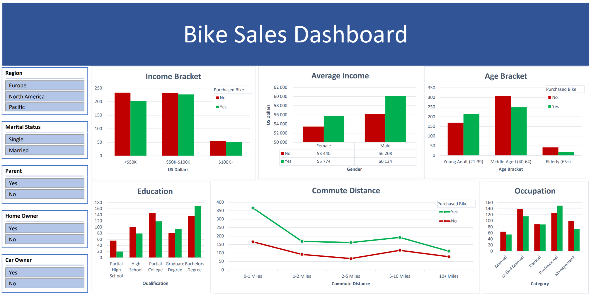

# Bike Sales

#### Data Analysis & Dashboard w/ Microsoft Excel

## Table of Contents

- [Project Overview](#project-overview)
- [Data Sources](#data-sources)
- [Findings](#findings)
- [Recommendations](#recommendations)

## Project Overview

This project, completed as part of a guided learning exercise, aims to provide insights into the sales performance of a  hypothetical company which sells bicycles.

Through the analysis of a dataset of customer information, we can draw insights as to whether various factors such as customer income level, age, and commute distance have an impact on the purchasing decision of a customer.

This would allow the business to identify which regions & groups of customers would be the most effective to target in terms of marketing strategy.

[**Interactive Dashboard**](https://1drv.ms/x/c/268b40e9c494717a/Efrz0z864QFArwPTXf49cnkBf5B-r9D7DeQTgxhMycm1gg?e=fcyq30&nav=MTVfe0REN0Q4MTUwLTU2QUQtNERFNC04OUQ2LTg0REIyNzZBRjVDOH0)

  
---  

### Data Sources

The primary dataset used for this analysis is the "Dataset" sheet ([available here](https://1drv.ms/x/c/268b40e9c494717a/Efrz0z864QFArwPTXf49cnkBf5B-r9D7DeQTgxhMycm1gg?e=JpKLQJ&nav=MTVfezAwMDAwMDAwLTAwMDEtMDAwMC0wMDAwLTAwMDAwMDAwMDAwMH0)) of the "bike-sales.xlsx" file; it contains various details pertaining to customers who either did or did not purchase bikes from the business.
  
---  

### Tools

- **Microsoft Excel**
    - Data Cleaning
    - Data Visualisation

---  

### Data Cleaning & Preparation

In the initial data preparation phase, we performed the following tasks:

1. Removing duplicate values from the dataset
2. Formatting the values of the 'Marital Status', 'Gender', and 'Income' columns to enhance readability
3. Feature engineering by means of discretisation of the following:
    - 'Age' column into an 'Age Bracket' column
    - 'Income' column into an 'Income Bracket' column
    - 'Children' column into a 'Parent' column
    - 'Cars' column into a 'Car Owner' column

  ---

### Exploratory Data Analysis

Created various pivot tables to guide us in answering the following key questions:

1. How does level of customer income affect sales?
2. How do sales vary across different customer age brackets?
3. To what degree does commute distance affect a customer's decision to purchase?
4. What is the distribution of sales across customer education levels?
5. What type of occupation do customers have, and does this affect sales?

Additionally, are the findings & trends observed with regards to the above questions universal across:
- Region
- Marital Status

---

### Findings

The analysis results can be summarised as follows:

1. A large proportion of global sales were made to customers with either a low (<$50K) or medium ($50K-$100K)  level of income.  Additionally, a trend can be observed in which customers who make purchases tend to have a higher average income than those who do not, with the exception of the European region,
    1. Regionally; more sales were made to customers with a low level of income in the European region, while in the North American region, more sales were made to customers with a medium level of income.
    2. In the Pacific region, single customers  were slightly more likely to make a purchase than married customers, across all income brackets.
       In the North American region, single customers with a medium level of income were much more likely to make a purchase than their married counterparts.

2. Globally, the majority of sales were made to young adult (21-39) & middle-aged (40-64) customers, while very few sales were made to elderly (65+) customers.
    1. In the European region, young adults marginally accounted for the majority of sales. In the North American region, middle-aged customers significantly accounted for the majority of sales.

3.  Customers with a commute distance of 0-1 miles tend to be more likely to make a purchase than any other customer group.
	1. The exception to this observation is the North American region - this could be due to the customer purchasing the bicycle for recreational purposes rather than transportation, and thus commute distance is a less relevant variable in their decision to purchase.

4. Across all  regions, customers who held a bachelors degree accounted for the most sales. Conversely, customers who only had partial high school education accounted for the least sales.
    1. In the North American region, sales were more evenly distributed across education levels, with the exception of partial high school level, than all other regions.
    2. In the European region, a disproportionately large amount of sales were made to customers who held a bachelor's degree & were married.
       In the North American region, single customers who held a bachelor's degree were far more likely to make a purchase than any other customer group.
       In the Pacific region, single customers who held a partial college level of education were significantly more likely to purchase a bike than their married counterparts.

5. While there is no clearly observable relationship between occupation and sales, some differences within regions were observed.
	2.  In the European region, sales were more numerous and more likely to single manual workers as opposed to their married counterparts. 
        In the North American region, sales were more numerous and more likely to single workers in management roles as opposed to their married counterparts. 

---

### Recommendations

Based on the analysis, we can recommend some suggested actions:

- Implement a customer segmentation strategy by tailoring marketing efforts to effectively target specific groups of customers as outlined by the findings section.

---

### Limitations

- With only 1000 rows of data remaining after cleaning was performed, the findings of this analysis may not be as accurate as opposed to a scenario where a larger dataset is used.

---  

### References

1. [YouTube Tutorial](https://www.youtube.com/watch?v=opJgMj1IUrc) - Alex The Analyst
